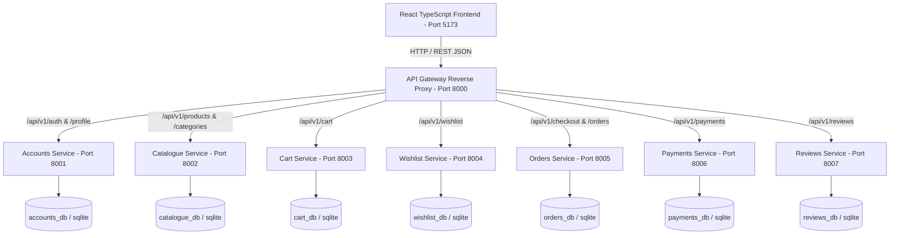

# 🌸 Sweet Sentiments — Microservices E-Commerce Platform

A portfolio-grade, full-stack microservices e-commerce platform built with **Django REST Framework** backend microservices and a modern **React + TypeScript + Vite** frontend.

---

## 🤖 Prompt for AI Agents (Copy & Paste into New AI Chat)

When cloning this repository onto a fresh machine or pointing an AI Coding Assistant (e.g. Antigravity, Claude, ChatGPT, Cursor, Copilot) to this project, simply copy and paste the prompt below into the chat:

```markdown
Hello! I have cloned the "Sweet Sentiments" e-commerce application repository. 
Please refer to `AGENTS.md` and `AGENT_SETUP_GUIDE.md` in the project root to understand the architecture, database fallback strategy, and service port map.

Please execute the automated bootstrap:
1. Run `python scripts/bootstrap_all.py` to install dependencies, run migrations, seed the 21 boutique products with catalogue images, and create superuser admin accounts.
2. Start all 7 Django microservices (ports 8001-8007), the API Gateway (port 8000), and the Vite frontend (port 5173).
3. Verify that http://localhost:5173 loads correctly with all product images and functionality intact.
```

---

## ⚡ 1-Click Automated Bootstrap

You can set up the entire platform (backend dependencies, frontend dependencies, database migrations, catalogue seeding with 21 products and images, and admin accounts) in one command:

```bash
python scripts/bootstrap_all.py
```

---

## 🏗️ 1. System Architecture



---

## 🧭 2. Microservice Directory & Port Mapping

| Service Name | Port | Default Database | Primary Responsibility |
| :--- | :---: | :---: | :--- |
| **Frontend** | `5173` | — | Aesthetic React 19 SPA with boutique theme, Cart, Wishlist, Auth |
| **API Gateway** | `8000` | None | Reverse proxy routing, CORS headers, rate throttling |
| **Accounts** | `8001` | `accounts_db` / SQLite | User authentication, token generation, profiles |
| **Catalogue** | `8002` | `catalogue_db` / SQLite | 6 categories, 21 boutique products, live stock inventory |
| **Cart** | `8003` | `cart_db` / SQLite | Persistent shopping cart & item quantity adjustments |
| **Wishlist** | `8004` | `wishlist_db` / SQLite | User wishlist with reactive heart icon syncing |
| **Orders** | `8005` | `orders_db` / SQLite | Checkout orchestration, snapshotting, order history |
| **Payments** | `8006` | `payments_db` / SQLite | Payment sandbox simulation (`SUCCESS`/`FAIL`/`CANCEL`) |
| **Reviews** | `8007` | `reviews_db` / SQLite | Product ratings (1-5★) and customer reviews |

---

## 🗄️ 3. Zero-Config Database Strategy

* **SQLite Fallback (Default)**: If PostgreSQL is not running or `DB_NAME` is omitted, every service automatically uses an embedded SQLite database (`db.sqlite3`). **Zero external database installation required.**
* **PostgreSQL (Optional)**: If you prefer PostgreSQL, set your `DB_NAME`, `DB_USER`, `DB_PASSWORD`, `DB_HOST`, and `DB_PORT` in your environment or `.env` files.

---

## 🖼️ 4. Product Catalogue & Images

* All **21 high-resolution lifestyle product images** and **6 category banners** are committed directly in `frontend/public/images/` and tracked by Git.
* Vite serves these images locally at `/images/products/...` with **zero external cloud storage or S3 bucket dependencies**.

---

## 🛠️ 5. Manual Setup & Running Instructions

### Step 1: Install Dependencies
```bash
# Python dependencies
pip install -r requirements.txt

# Frontend dependencies
cd frontend && npm install && cd ..
```

### Step 2: Run Database Migrations
```bash
python services/accounts/manage.py migrate
python services/catalogue/manage.py migrate
python services/cart/manage.py migrate
python services/wishlist/manage.py migrate
python services/orders/manage.py migrate
python services/payments/manage.py migrate
python services/reviews/manage.py migrate
```

### Step 3: Seed Catalogue Data & Create Superusers
```bash
# Seed 21 products & 6 categories
python services/catalogue/manage.py seed_data

# Create admin accounts (admin / admin123)
python setup_admins.py
```

### Step 4: Start Development Servers
```bash
# Gateway & Services
python gateway/manage.py runserver 8000
python services/accounts/manage.py runserver 8001
python services/catalogue/manage.py runserver 8002
python services/cart/manage.py runserver 8003
python services/wishlist/manage.py runserver 8004
python services/orders/manage.py runserver 8005
python services/payments/manage.py runserver 8006
python services/reviews/manage.py runserver 8007

# Frontend
cd frontend
npm run dev
```

Open **`http://localhost:5173`** in your browser.

---

## 🔑 6. Default Admin Credentials

* **Username**: `admin`
* **Password**: `admin123`
* **Admin Interfaces**:
  * Catalogue Admin: `http://localhost:8002/admin/`
  * Accounts Admin: `http://localhost:8001/admin/`
  * Orders Admin: `http://localhost:8005/admin/`
  * Reviews Admin: `http://localhost:8007/admin/`

---

## 🧪 7. Automated Testing & Quality Assurance

### Run Microservice Test Suites:
```bash
python gateway/manage.py test tests
python services/accounts/manage.py test tests
python services/catalogue/manage.py test tests
python services/cart/manage.py test tests
python services/orders/manage.py test tests
python services/payments/manage.py test tests
python services/reviews/manage.py test tests
python services/wishlist/manage.py test tests
```

---

## 📚 8. Documentation Index

| Documentation File | Contents & Purpose |
| :--- | :--- |
| [`AGENTS.md`](AGENTS.md) | Standard instructions file for AI agents on fresh clones |
| [`AGENT_SETUP_GUIDE.md`](AGENT_SETUP_GUIDE.md) | Comprehensive architecture, setup, and troubleshooting guide |
| [`docs/architecture.md`](docs/architecture.md) | High-level system context map, proxy routes, resilience strategy |
| [`docs/data-model.md`](docs/data-model.md) | Per-service Entity-Relationship Diagrams (ERDs) |
| [`docs/api.md`](docs/api.md) | Complete REST API contract specification across microservices |
| [`docs/security-audit.md`](docs/security-audit.md) | Security threat matrix, rate throttling, and defense-in-depth audit |
| [`docs/deployment-guide.md`](docs/deployment-guide.md) | Production Docker deployment and static asset strategy |
| [`docs/testing.md`](docs/testing.md) | Comprehensive test suite guide and E2E testing |
