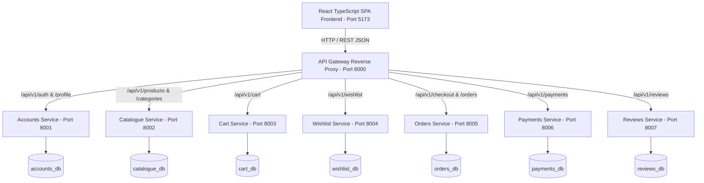

# Shop Platform — Microservices E-Commerce Application

A portfolio-grade, full-stack microservices e-commerce platform built with **Django REST Framework** backend microservices and a modern **React + TypeScript + Vite** frontend.

---

## 1. System Architecture



---

## 2. Microservice Directory & Port Mapping

| Service Name | Port | Database | Primary Responsibility |
|--------------|------|----------|------------------------|
| **API Gateway** | `8000` | None | Public reverse proxy, CORS, rate limiting (`200/min` anon, `1000/min` user) |
| **Accounts** | `8001` | `accounts_db` | Authentication, Token generation, Profiles, Shipping Addresses |
| **Catalogue** | `8002` | `catalogue_db` | Categories, Product specifications, Stock inventory management |
| **Cart** | `8003` | `cart_db` | User-bound persistent Shopping Carts & Line Items |
| **Wishlist** | `8004` | `wishlist_db` | Product Wishlists with unique product constraints |
| **Orders** | `8005` | `orders_db` | Checkout orchestration, price/SKU snapshotting, Order history |
| **Payments** | `8006` | `payments_db` | Payment Sandbox simulation (`SUCCESS`/`FAIL`/`CANCEL`) & idempotency |
| **Reviews** | `8007` | `reviews_db` | Product Ratings (1-5 stars validation) & Customer Reviews |
| **Frontend** | `5173` | — | Glassmorphism React 19 SPA with accessibility focus rings |

---

## 3. Quick Start & Setup Instructions

### Prerequisites
- **Python:** 3.12+
- **Node.js:** 18+ & npm
- **PostgreSQL:** 15+

### 1. Database Creation
Execute in PostgreSQL shell (`psql`):
```sql
CREATE USER shop_dev WITH PASSWORD 'shop_password';

CREATE DATABASE shop_accounts_db  OWNER shop_dev;
CREATE DATABASE shop_catalogue_db OWNER shop_dev;
CREATE DATABASE shop_cart_db      OWNER shop_dev;
CREATE DATABASE shop_wishlist_db  OWNER shop_dev;
CREATE DATABASE shop_orders_db    OWNER shop_dev;
CREATE DATABASE shop_payments_db  OWNER shop_dev;
CREATE DATABASE shop_reviews_db   OWNER shop_dev;
```

### 2. Environment Configuration
Copy `.env.example` to `.env` in `gateway/` and every service under `services/`:
```bash
cp gateway/.env.example gateway/.env
cp services/accounts/.env.example services/accounts/.env
cp services/catalogue/.env.example services/catalogue/.env
cp services/cart/.env.example services/cart/.env
cp services/wishlist/.env.example services/wishlist/.env
cp services/orders/.env.example services/orders/.env
cp services/payments/.env.example services/payments/.env
cp services/reviews/.env.example services/reviews/.env
```

### 3. Run Database Migrations
```bash
cd services/accounts  && python manage.py migrate
cd services/catalogue && python manage.py migrate
cd services/cart      && python manage.py migrate
cd services/wishlist  && python manage.py migrate
cd services/orders    && python manage.py migrate
cd services/payments  && python manage.py migrate
cd services/reviews   && python manage.py migrate
```

### 4. Start Development Servers
Start each backend service on its designated port:
```bash
python manage.py runserver 8000 # Gateway
python manage.py runserver 8001 # Accounts
python manage.py runserver 8002 # Catalogue
python manage.py runserver 8003 # Cart
python manage.py runserver 8004 # Wishlist
python manage.py runserver 8005 # Orders
python manage.py runserver 8006 # Payments
python manage.py runserver 8007 # Reviews
```

Start Frontend development server:
```bash
cd shop-platform/frontend
npm install
npm run dev
```
Open **`http://localhost:5173`** in your browser.

---

## 4. Automated Testing & Quality Assurance

### Running All Backend Microservice Test Suites (112 Tests Total)
```bash
cd gateway && python manage.py test tests
cd services/accounts && python manage.py test tests
cd services/catalogue && python manage.py test tests
cd services/cart && python manage.py test tests
cd services/orders && python manage.py test tests
cd services/payments && python manage.py test tests
cd services/reviews && python manage.py test tests
cd services/wishlist && python manage.py test tests
```

### Running Frontend Tests & Full 9-Step E2E Integration Suite
```bash
cd shop-platform/frontend
npx tsx src/api/e2eCustomerJourney.test.ts
npm run build
npm run lint
```

---

## 5. Live Demo & Presentation Walkthrough Script

### Presentation Script (3-Minute Overview)
1. **Introduction:** *"Welcome! This is the Shop Platform microservices e-commerce application. It features 8 decoupled Django REST services communicating through a central API Gateway, backed by independent PostgreSQL databases and a React TypeScript frontend."*
2. **Product Catalogue & Search:** *"Users can search products, filter by category or price range, and sort in real-time. Notice the glassmorphism UI card styling with live stock availability badges."*
3. **Product Detail & Reviews:** *"Clicking any product opens the detail modal displaying aggregate star ratings, rating distribution breakdown bars (5★ to 1★), customer feedback items, and an interactive review submission form with 1-5 star validation."*
4. **Wishlist & Cart:** *"Logged-in users can bookmark products to their Wishlist or add items to their persistent Shopping Cart with real-time quantity adjustments."*
5. **Checkout & Payment Sandbox:** *"At checkout, the system snapshots product names, SKUs, and prices into the order record, processes the payment via the Payment Sandbox simulation, and clears the cart."*
6. **Order History & Admin Operations:** *"Customers can inspect past orders in Order History, while administrators can moderate reviews and manage inventory."*

---

## 6. Project Documentation Index

| Documentation File | Contents & Purpose |
|--------------------|--------------------|
| [`docs/architecture.md`](docs/architecture.md) | High-level system context map, proxy routes, resilience strategy |
| [`docs/data-model.md`](docs/data-model.md) | Per-service Entity-Relationship Diagrams (ERDs) in Mermaid syntax |
| [`docs/api.md`](docs/api.md) | Complete REST API contract specification across all 8 microservices |
| [`docs/security-audit.md`](docs/security-audit.md) | Security threat matrix, rate throttling, and defense-in-depth audit |
| [`docs/deployment-guide.md`](docs/deployment-guide.md) | Production Docker deployment, static asset strategy, and secret management |
| [`docs/testing.md`](docs/testing.md) | Comprehensive test suite guide, E2E customer journey runner |
| [`docs/PROGRESS.md`](docs/PROGRESS.md) | Chronological task completion and git commit verification log |

---

## 7. Known Limitations & Future Roadmap

1. **Distributed Tracing:** Future iterations could incorporate Jaeger / OpenTelemetry for distributed trace propagation across Gateway proxies.
2. **Event Bus (Asynchronous Messaging):** Currently service-to-service calls use HTTP REST proxying. Integrating RabbitMQ or Apache Kafka would allow asynchronous event-driven inventory updates.
3. **Multi-Currency Support:** Currently transactions process in USD (`$`). Adding FX exchange rate microservices would enable multi-currency browsing.
