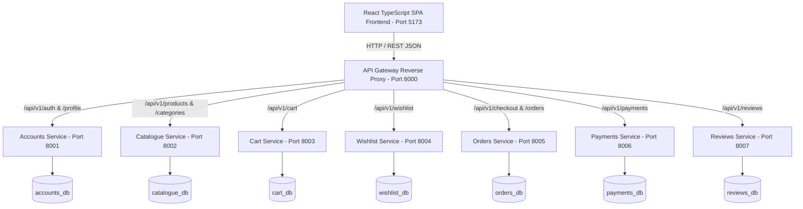

# Architecture & Context Map — Shop Platform

## 1. High-Level System Architecture

---

## 2. Microservice Boundaries & Responsibilities

### 1. API Gateway (`gateway/`)
- Single public entry point for all frontend client communication.
- Manages CORS headers, proxy headers (`X-Forwarded-For`, `Authorization`), and correlation IDs.
- Enforces rate limiting throttling (`AnonRateThrottle`: 200/min, `UserRateThrottle`: 1000/min).

### 2. Identity & Accounts Service (`services/accounts`)
- Manages User registration, Token Authentication, and password security (PBKDF2 SHA256).
- Manages User Profile data and Shipping Addresses.
- Enforces user ownership isolation for profile & address operations.

### 3. Product Catalogue Service (`services/catalogue`)
- Manages product master data, pricing, stock levels, categories, and inventory updates.
- Supports search, price filtering, category filtering, and admin inventory updates.

### 4. Shopping Cart Service (`services/cart`)
- Manages user-bound persistent shopping cart items and quantities.
- Communicates with Catalogue service to validate live stock availability.

### 5. Wishlist Service (`services/wishlist`)
- Manages user product wishlists with duplicate item prevention.

### 6. Orders & Checkout Service (`services/orders`)
- Orchestrates checkout operations: snapshotting price, SKU, product name, and shipping address.
- Decrements inventory in Catalogue service and clears active shopping cart upon successful checkout.

### 7. Payment Sandbox Service (`services/payments`)
- Simulates payment transaction processing (`INITIATED`, `SUCCESS`, `FAILED`, `CANCELLED`).
- Enforces idempotency via transaction reference keys.

### 8. Reviews & Ratings Service (`services/reviews`)
- Manages customer product reviews (1 to 5 stars rating validation).
- Computes aggregate rating scores and rating breakdown distributions.

---

## 3. Communication Patterns & Resilience
- **Synchronous REST/HTTP Proxying:** Gateway routes requests directly to internal microservice ports.
- **Fail-Safe Service Isolation:** If an internal microservice fails, the API Gateway returns a clean JSON error response (`502 Bad Gateway` / `503 Service Unavailable`) without exposing internal tracebacks.
- **Price & Item Snapshotting:** Orders store immutable copies of product names, SKUs, and prices to prevent historic order corruption when catalogue prices change.
