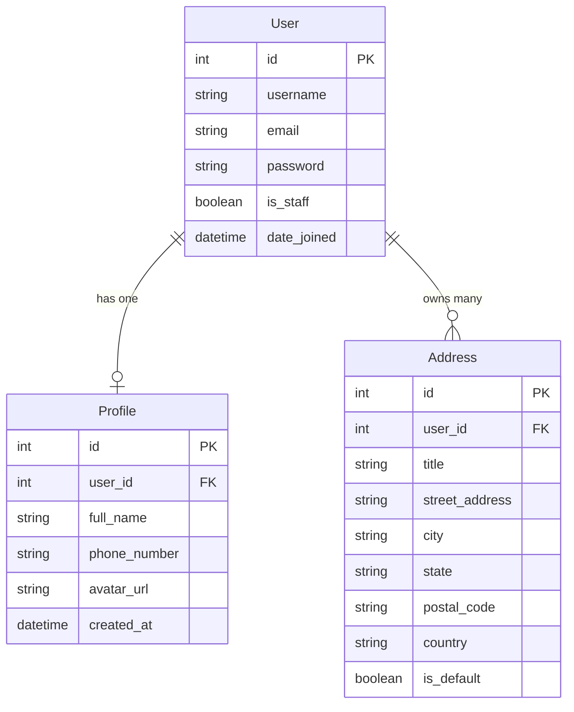
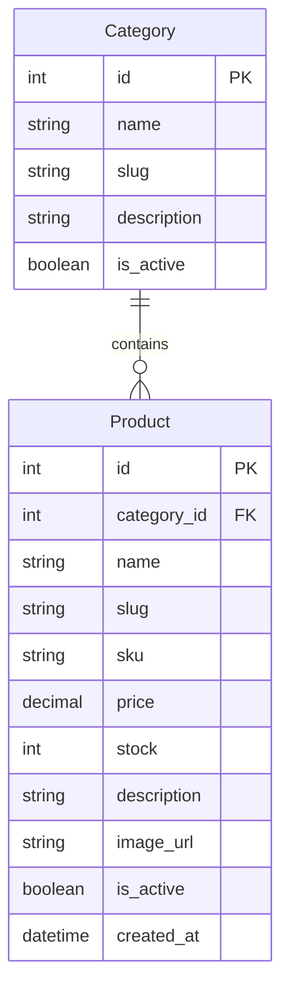
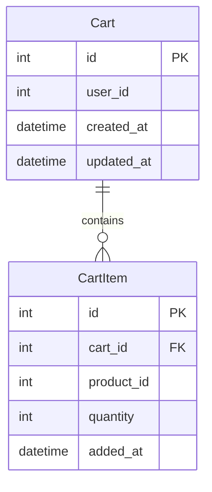
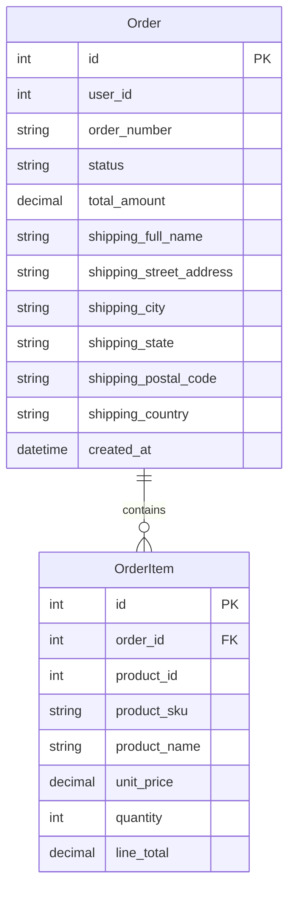
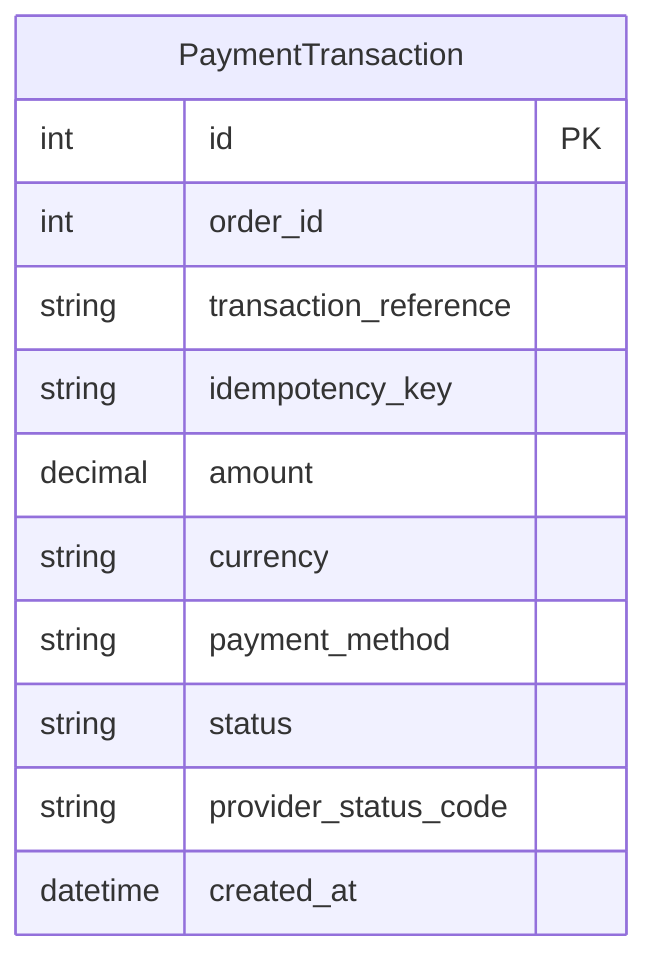
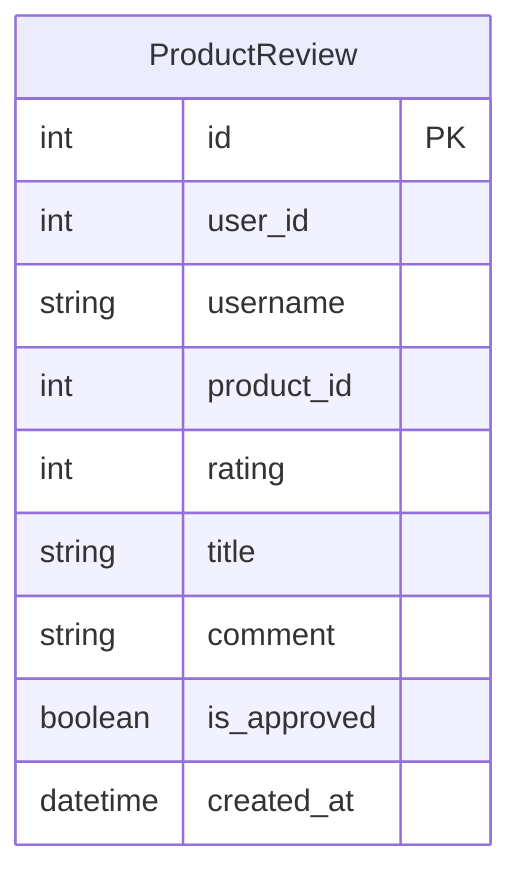

# Data Model & Entity-Relationship Diagrams — Shop Platform

## 1. Data Ownership Architecture & Isolation
The application strictly enforces **Database-per-Service** isolation. No database shares tables or relationships with another microservice.

- **Accounts Service** owns User identity, Profile extensions, and Shipping Addresses.
- **Catalogue Service** owns Category taxonomies and Product specifications.
- **Cart Service** owns active Shopping Carts and line items.
- **Wishlist Service** owns customer Wishlist items.
- **Orders Service** owns Order headers and Order Line Items (snapshotting product price/name/SKU at checkout time).
- **Payments Service** owns Sandbox Payment Transactions and idempotency tokens.
- **Reviews Service** owns Product Reviews, Rating scores (1-5), and moderation status.

---

## 2. Microservice Entity-Relationship Diagrams (ERDs)

### Accounts Microservice Schema (`accounts_db`)

---

### Catalogue Microservice Schema (`catalogue_db`)

---

### Cart Microservice Schema (`cart_db`)

---

### Orders Microservice Schema (`orders_db`)

---

### Payments Microservice Schema (`payments_db`)

---

### Reviews Microservice Schema (`reviews_db`)

